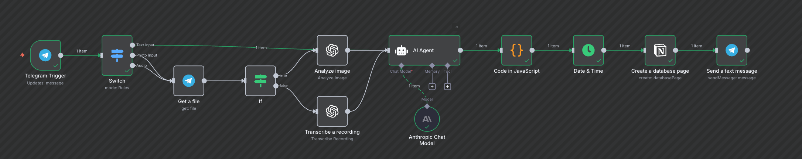
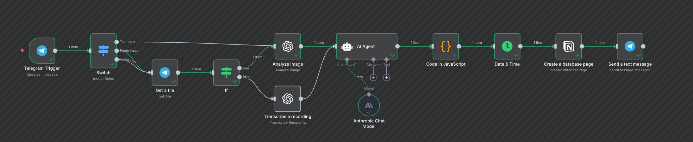
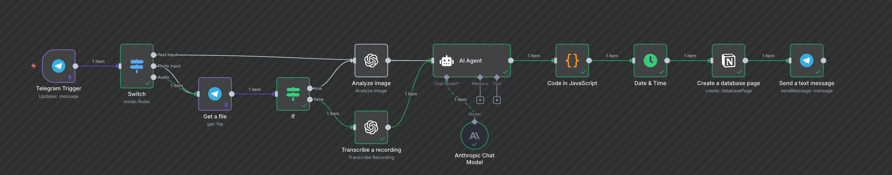

# Telegram Expense Tracker Automation (n8n + Notion)

This project is an **automation workflow** built with [n8n](https://n8n.io/) that lets you **track and log your expenses directly from Telegram**.

You can send a **text message**, a **photo of a receipt**, or a **voice note**, and the system will automatically process using AI to analyze the input (audio, photo or text message), then save the data into a Notion database (expense tracker template).

---

## Features

- **Text Input** → Send a plain text message describing your expense. 
- **Photo Input** → Send a picture of a receipt or bill, automatically analyzed via AI.
- **Audio Input** → Send a short voice message describing the expense, automatically transcribed into text.
- **AI Agent Integration** → Normalizes your input into structured expense data (date, category, description, amount).
- **Notion Database Integration** → Logs every expense into a Notion template for easy budgeting and tracking.
- **Multi-Input Support** → Works seamlessly across text, image, and audio.

## Input Examples

### Simple Text Expense

Send a quick message like "Groceries 24.95" and the workflow extracts the description, amount, and date automatically.

### Receipt Photo

Snap a picture of a receipt; the AI pulls totals and merchant details before the entry hits Notion.

### Voice Note Expense

Record a short voice memo on the go; the transcription plus AI parsing turns it into structured data.

---

## Workflow Overview

1. **Telegram Trigger**  
   Captures messages from your personal Telegram bot.

2. **Switch Node**  
   Routes messages by type:
   - Text
   - Photo
   - Audio

3. **File Retrieval**  
   For photo/audio, fetches the actual file.

4. **Conditional (If Node)**  
   - Sends images → AI Image Analysis  
   - Sends audio → AI Transcription  

5. **AI Processing**  
   Uses OpenAI/Anthropic models to interpret the content and structure the expense.

6. **Data Formatting**  
   Runs through a JavaScript node to normalize the final output.

7. **Date & Time**  
   Stamps each entry. (Time can improve via MCP or proper configuration of the LLMs with the System Message, but for the sake of the ilustration this workflow only records current dates when the transaction was sent. The potential of explicitley saying to the chat a specific transaction data can be improved in following PRs using the a better system prompt and changing the last nodes)

8. **Notion Database Page Creation**  
   Creates a new page/entry in your Notion expense tracker database.

9. **Telegram Confirmation**  
   Sends a confirmation message back to you. (E.g "Your expense  for 472 has been properly saved in Notion")

---

## How to Replicate This

1. **Set Up a Telegram Bot**  
   - Open [BotFather](https://t.me/BotFather) in Telegram, send `/newbot`, and follow the prompts to name your bot.  
   - Copy the access token BotFather returns so you can configure the Telegram Trigger node later.  
   

2. **Prepare Your Notion Database**  
   - Use your own Notion expense tracker template, browse Notion's expense tracker gallery at https://www.notion.com/templates/category/expense-tracker, or create one with fields for Date, Category, Amount, and Description.

3. **Install n8n**  
   - [Install locally](https://docs.n8n.io/hosting/installation/) or use [n8n Cloud](https://n8n.io/cloud).

4. **Import the Workflow**  
   - Create a new workflow from scratch or use the provided JSON in n8n and configure the nodes as shown in the screenshot.

5. **Configure the AI Nodes**  
   - Add your OpenAI/Anthropic API keys. (Feel free yo use any other LLM brain for the AI agent but open AI Wisper and ORC is required)

6. **Test It**  
   - Send a text, image, or audio message to your Telegram bot.  
   - Check your Notion database to see the logged expense.

---

## Tech Stack

- [n8n](https://n8n.io/)
- [Telegram Bot API](https://core.telegram.org/bots/api)
- [Notion API](https://developers.notion.com/)
- [OpenAI / Anthropic Models](https://openai.com/)

---

## License

This project is licensed under the MIT License.
